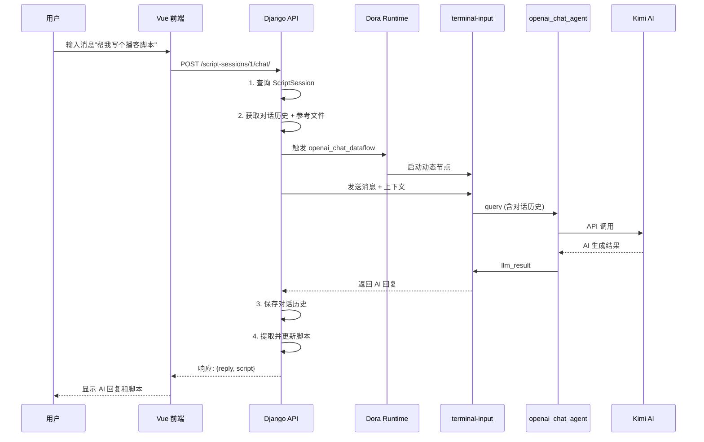
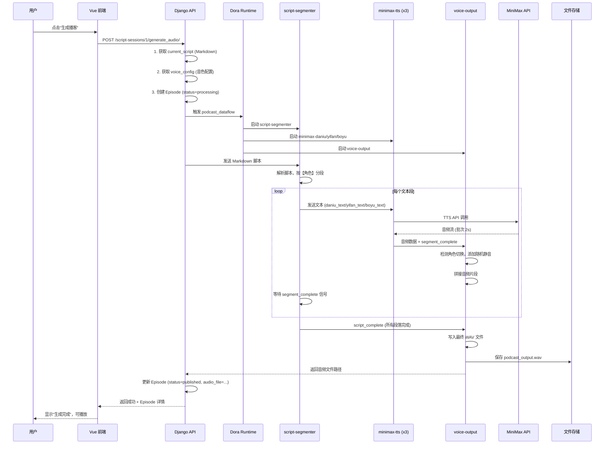
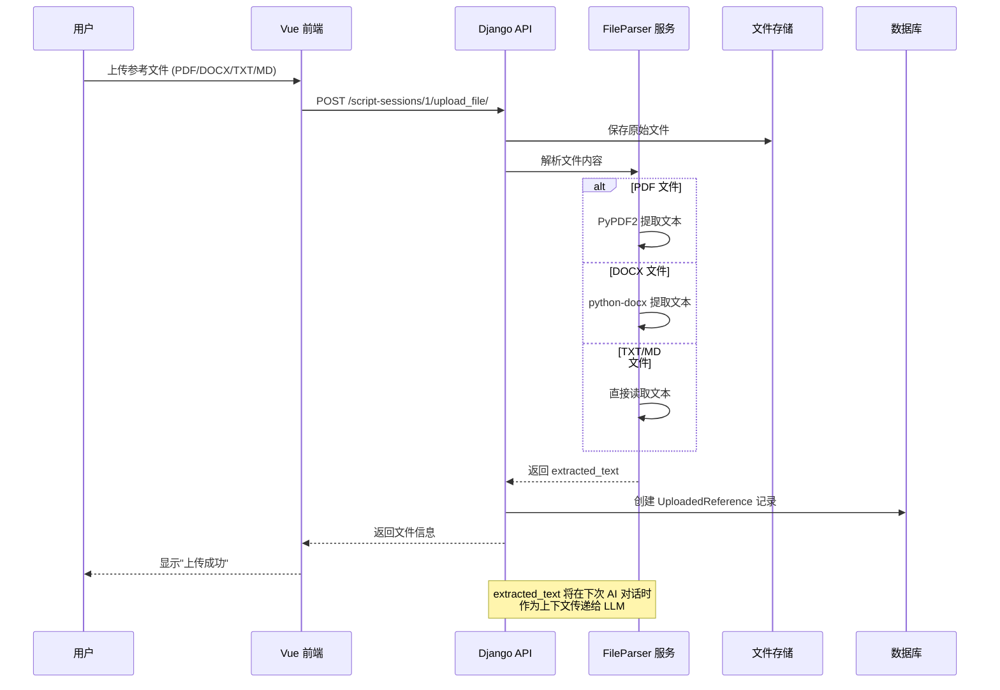
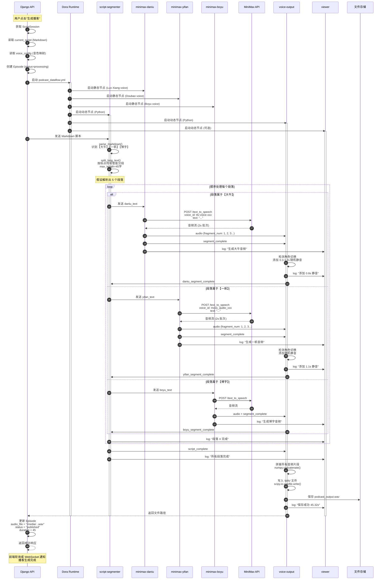
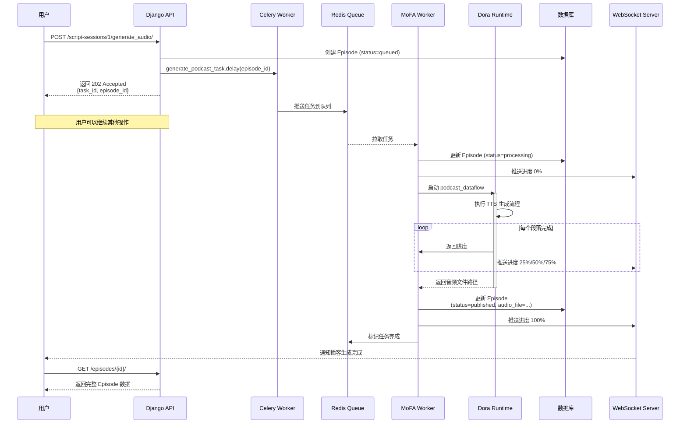
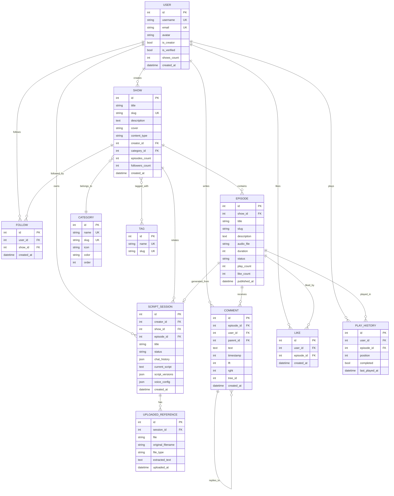

# MoFA FM 架构设计

## 系统总览架构图

```mermaid
graph TB
    subgraph "🎨 前端层 Frontend Layer"
        subgraph "Vue 3 + Vite 应用"
            Home[Home.vue<br/>首页 - 播客推荐]
            Discover[Discover.vue<br/>发现 - 分类浏览]
            Search[Search.vue<br/>搜索页面]
            Library[Library.vue<br/>我的收藏]

            subgraph "创作者工作台"
                Dashboard[Creator Dashboard<br/>创作者仪表盘]
                UI[AIScriptStudio.vue<br/>🤖 AI 脚本创作工作室]
                CreateShow[CreateShow.vue<br/>创建节目]
                ManageShow[ManageShow.vue<br/>管理节目]
            end

            ShowDetail[ShowDetail.vue<br/>节目详情页]
            EpisodeDetail[EpisodeDetail.vue<br/>单集详情页]
            Player[GlobalPlayer.vue<br/>🎵 全局播放器]

            subgraph "Pinia 状态管理"
                AuthStore[auth.js<br/>用户认证状态]
                PlayerStore[player.js<br/>播放器状态]
                PodcastStore[podcasts.js<br/>播客数据缓存]
            end
        end
    end

    subgraph "🔧 后端层 Backend Layer"
        subgraph "Django REST Framework"
            Router[URL Router<br/>config/urls.py]

            subgraph "API ViewSets"
                UserAPI[users/api/<br/>用户注册登录<br/>创作者验证]
                PodcastAPI[podcasts/api/<br/>节目管理<br/>单集管理<br/>分类标签]
                ScriptAPI[podcasts/api/<br/>🎯 ScriptSession API<br/>AI 脚本会话]
                InteractionAPI[interactions/api/<br/>评论点赞关注<br/>播放历史]
                SearchAPI[search/api/<br/>全文搜索]
            end

            subgraph "Service Layer"
                FileParser[file_parser.py<br/>📄 文件解析服务<br/>PDF/DOCX/TXT/MD]
                ScriptAI[script_ai.py<br/>🤖 AI 对话服务<br/>⚠️ 待替换为 MoFA]
                AudioProc[audio_processor.py<br/>🎵 音频处理<br/>⚠️ 待替换为 MoFA]
            end

            subgraph "Django Models"
                User[User<br/>用户模型]
                Show[Show<br/>播客节目]
                Episode[Episode<br/>播客单集]
                ScriptSession[ScriptSession<br/>AI 脚本会话]
                UploadRef[UploadedReference<br/>参考文件]
                Comment[Comment<br/>评论 MPTT 树]
                Follow[Follow/Like<br/>互动关系]
                PlayHistory[PlayHistory<br/>播放历史]
            end
        end

        subgraph "任务队列"
            Celery[Celery Worker<br/>异步任务处理]
            CeleryBeat[Celery Beat<br/>定时任务调度]
        end
    end

    subgraph "🔄 MoFA 数据流层 DataFlow Layer"
        subgraph "Dora Runtime 运行时"
            DoraCore[Dora Core<br/>Rust 数据流引擎<br/>节点通信管理]
        end

        subgraph "💬 AI 对话数据流"
            subgraph "openai_chat_dataflow.yml"
                TI1[terminal-input<br/>🔷 动态节点<br/>─────────<br/>接收: Django 消息<br/>发送: query<br/>接收: llm_result<br/>返回: Django API]

                OAI[openai_chat_agent<br/>🔶 静态节点<br/>─────────<br/>输入: query<br/>处理: 调用 LLM API<br/>输出: llm_result]
            end
        end

        subgraph "🎙️ 播客生成数据流"
            subgraph "podcast_dataflow.yml"
                SS[script-segmenter<br/>🔷 动态节点<br/>─────────<br/>接收: Markdown 脚本<br/>解析: 【角色】标签<br/>分段: 智能分割长文本<br/>输出: 角色_text<br/>      script_complete]

                subgraph "TTS 引擎节点组"
                    TTS1[minimax-daniu<br/>🔶 静态节点<br/>─────────<br/>音色: 大牛 刘翔<br/>输入: daniu_text<br/>调用: MiniMax API<br/>批次: 2s audio chunks<br/>输出: audio, segment_complete]

                    TTS2[minimax-yifan<br/>🔶 静态节点<br/>─────────<br/>音色: 一帆 豆包<br/>输入: yifan_text<br/>调用: MiniMax API<br/>批次: 2s audio chunks<br/>输出: audio, segment_complete]

                    TTS3[minimax-boyu<br/>🔶 静态节点<br/>─────────<br/>音色: 博宇<br/>输入: boyu_text<br/>调用: MiniMax API<br/>批次: 2s audio chunks<br/>输出: audio, segment_complete]
                end

                VO[voice-output<br/>🔷 动态节点<br/>─────────<br/>输入: 多路 audio + segment_complete<br/>处理: 角色切换检测<br/>      随机静音 0.3-1.2s<br/>      音频拼接 numpy<br/>输出: 最终 WAV 文件<br/>队列: queue_size=1000]

                Viewer[viewer<br/>🔷 动态节点<br/>─────────<br/>接收: 所有 log 输出<br/>显示: 实时彩色日志<br/>监控: 节点状态<br/>可选: 调试用]
            end
        end
    end

    subgraph "💾 存储层 Storage Layer"
        DB[(PostgreSQL<br/>─────────<br/>• 用户数据<br/>• 播客元数据<br/>• 脚本会话<br/>• 对话历史<br/>• 评论互动<br/>• 播放记录)]

        Redis[(Redis<br/>─────────<br/>• Celery 队列<br/>• 会话缓存<br/>• 播放进度<br/>• 搜索缓存)]

        Media[Media 文件存储<br/>─────────<br/>• 播客音频 WAV/MP3<br/>• 节目封面图<br/>• 用户头像<br/>• 参考文件 PDF/DOCX]
    end

    subgraph "🌐 外部服务 External Services"
        Kimi[Kimi AI API<br/>─────────<br/>模型: Moonshot<br/>用途: LLM 对话生成<br/>      脚本创作<br/>上下文: 8k tokens]

        MiniMax[MiniMax T2A API<br/>─────────<br/>服务: 文本转语音<br/>音色: 多种中文声音<br/>格式: PCM 32kHz 16bit<br/>流式: WebSocket 推送]
    end

    %% ═══════════════ 数据流连接 ═══════════════

    %% 前端到后端 HTTP/WebSocket
    Home & Discover & Search & Library -->|GET /api/podcasts/| PodcastAPI
    ShowDetail & EpisodeDetail -->|GET /api/podcasts/shows/| PodcastAPI
    UI -->|POST /api/script-sessions/:id/chat/| ScriptAPI
    UI -->|POST /api/script-sessions/:id/generate_audio/| ScriptAPI
    UI -->|POST /api/script-sessions/:id/upload_file/| ScriptAPI
    Dashboard -->|GET /api/podcasts/my-shows/| PodcastAPI
    Player -->|POST /api/interactions/play/update/| InteractionAPI

    %% 前端状态管理
    UI & Dashboard & ShowDetail -.-> AuthStore & PlayerStore & PodcastStore

    %% 后端路由
    Router --> UserAPI & PodcastAPI & ScriptAPI & InteractionAPI & SearchAPI

    %% API 到 Service
    ScriptAPI -->|调用| FileParser
    ScriptAPI -->|⚠️ 待移除| ScriptAI
    PodcastAPI -->|⚠️ 待移除| AudioProc

    %% Service 到 Models
    UserAPI --> User
    PodcastAPI --> Show & Episode
    ScriptAPI --> ScriptSession & UploadRef
    InteractionAPI --> Comment & Follow & PlayHistory

    %% Models 到数据库
    User & Show & Episode & ScriptSession & UploadRef & Comment & Follow & PlayHistory --> DB

    %% 后端触发 MoFA 数据流 (虚线 = 未来实现)
    ScriptAPI -.->|🔜 触发 AI 对话流<br/>传递: chat_history + uploaded_files| DoraCore
    ScriptAPI -.->|🔜 触发播客生成流<br/>传递: current_script + voice_config| DoraCore

    %% Dora 管理数据流
    DoraCore --> TI1 & OAI
    DoraCore --> SS & TTS1 & TTS2 & TTS3 & VO & Viewer

    %% AI 对话流内部
    TI1 <-->|query| OAI
    OAI -->|API 请求| Kimi
    Kimi -->|AI 回复| OAI
    TI1 -.->|llm_result| ScriptAPI

    %% 播客生成流内部
    SS -->|daniu_text| TTS1
    SS -->|yifan_text| TTS2
    SS -->|boyu_text| TTS3
    SS -->|script_complete| VO

    TTS1 & TTS2 & TTS3 -->|API 请求| MiniMax
    MiniMax -->|音频流 PCM| TTS1 & TTS2 & TTS3

    TTS1 -->|audio + segment_complete| VO
    TTS2 -->|audio + segment_complete| VO
    TTS3 -->|audio + segment_complete| VO

    SS & TTS1 & TTS2 & TTS3 & VO -->|log| Viewer

    VO -.->|生成的 WAV<br/>保存路径| Media
    Media -.->|文件路径| ScriptAPI
    ScriptAPI -.->|更新 Episode.audio_file<br/>status=published| Episode

    %% 文件上传
    FileParser --> Media
    UploadRef --> Media

    %% 异步任务
    PodcastAPI & InteractionAPI --> Celery
    Celery --> Redis
    CeleryBeat --> Celery

    %% 缓存
    ScriptAPI & PodcastAPI & InteractionAPI <--> Redis

    %% ═══════════════ 样式定义 ═══════════════
    classDef frontend fill:#6dcad0,stroke:#333,stroke-width:3px,color:#000
    classDef backend fill:#ffc63e,stroke:#333,stroke-width:3px,color:#000
    classDef mofa fill:#ff513b,stroke:#333,stroke-width:3px,color:#fff
    classDef storage fill:#fd553f,stroke:#333,stroke-width:3px,color:#fff
    classDef external fill:#b4a7d6,stroke:#333,stroke-width:3px,color:#000
    classDef deprecated fill:#ffa07a,stroke:#d00,stroke-width:2px,stroke-dasharray: 5 5,color:#000

    class Home,Discover,Search,Library,Dashboard,UI,CreateShow,ManageShow,ShowDetail,EpisodeDetail,Player,AuthStore,PlayerStore,PodcastStore frontend
    class Router,UserAPI,PodcastAPI,ScriptAPI,InteractionAPI,SearchAPI,FileParser,User,Show,Episode,ScriptSession,UploadRef,Comment,Follow,PlayHistory,Celery,CeleryBeat backend
    class DoraCore,TI1,OAI,SS,TTS1,TTS2,TTS3,VO,Viewer mofa
    class DB,Redis,Media storage
    class Kimi,MiniMax external
    class ScriptAI,AudioProc deprecated
```



## 数据流详解

### 1. AI 对话流程



### 2. 播客生成流程



### 3. 文件上传流程



## 技术栈总结

| 层级 | 技术 | 作用 |
|------|------|------|
| **前端** | Vue 3 + Vite + Pinia | 用户界面，状态管理 |
| **后端** | Django 5.1 + DRF | API 服务，业务逻辑，数据库 ORM |
| **数据流** | MoFA + Dora (Rust) | 数据流编排，节点通信 |
| **AI 对话** | openai_chat_agent + Kimi API | LLM 对话生成 |
| **语音合成** | minimax-t2a + MiniMax API | 文本转语音 (TTS) |
| **音频处理** | script-segmenter + voice-output | 脚本解析，音频拼接 |
| **数据库** | PostgreSQL / SQLite | 持久化存储 |
| **缓存/队列** | Redis + Celery | 异步任务，缓存 |
| **文件存储** | 本地 Media 文件系统 | 音频、图片、文档 |

## 核心设计原则

### 1. **关注点分离**
- **Django**: 负责业务逻辑、数据管理、用户认证
- **MoFA**: 负责计算密集型任务 (AI 对话、TTS 生成)
- **前端**: 负责用户交互、状态展示

### 2. **数据流驱动**
- 使用 MoFA 的数据流范式，将复杂任务拆解为独立节点
- 节点间通过定义良好的输入/输出通道通信
- 支持动态节点 (Python) 和静态节点 (Dora 管理)

### 3. **异步与实时**
- **AI 对话**: 可选 WebSocket 实现流式响应
- **音频生成**: 异步任务，前端轮询或 WebSocket 推送进度
- **播放器**: 实时播放，进度保存

### 4. **模块化与可扩展**
- 新增音色：只需修改 dataflow.yml 的 `env.MINIMAX_VOICE_ID`
- 新增角色：在 script-segmenter 的 `character_aliases` 添加映射
- 新增 LLM：替换 openai_chat_agent 的 API 配置

### 5. **错误处理与监控**
- MoFA 节点：使用 `send_log()` 输出日志
- Django：使用 DRF 异常处理
- Viewer 节点：实时监控数据流执行状态

## MoFA 数据流节点详解

### openai_chat_agent 节点内部结构

```mermaid
graph TB
    subgraph "openai_chat_agent 节点 (MofaAgent)"
        Input[输入通道<br/>query]

        subgraph "main.py 处理流程"
            Receive[1. receive_parameter<br/>接收 query 数据]
            LoadEnv[2. load_dotenv<br/>加载环境变量]

            subgraph "call_openai_directly 函数"
                InitClient[3. 初始化 OpenAI Client<br/>api_key: LLM_API_KEY<br/>base_url: LLM_API_BASE]
                CreateMsg[4. 构建消息列表<br/>system + user]
                CallAPI[5. client.chat.completions.create<br/>model: LLM_MODEL]
                Extract[6. 提取 response.choices[0].message.content]
            end

            SendOut[7. send_output<br/>agent_output_name: llm_result]
            Log[8. write_log<br/>记录日志]
        end

        Output[输出通道<br/>llm_result]

        Input --> Receive
        Receive --> LoadEnv
        LoadEnv --> InitClient
        InitClient --> CreateMsg
        CreateMsg --> CallAPI
        CallAPI --> Extract
        Extract --> SendOut
        SendOut --> Output
        Receive & CallAPI & SendOut --> Log
    end

    Kimi[Kimi AI API<br/>https://api.moonshot.cn]

    CallAPI -->|HTTPS POST| Kimi
    Kimi -->|JSON Response| Extract

    classDef process fill:#ffc63e,stroke:#333,stroke-width:2px
    classDef io fill:#6dcad0,stroke:#333,stroke-width:2px
    classDef external fill:#b4a7d6,stroke:#333,stroke-width:2px

    class Receive,LoadEnv,InitClient,CreateMsg,CallAPI,Extract,SendOut,Log process
    class Input,Output io
    class Kimi external
```

### podcast-generator 数据流时序图



## Django 与 MoFA 集成架构

### 集成方式对比

```mermaid
graph TB
    subgraph "方案 A: 直接集成 (推荐)"
        DjangoA[Django API]
        subgraph "Python 子进程"
            MofaAgentA[MofaAgent<br/>Python 实例]
            DoraNodeA[Dora Node<br/>连接到 Runtime]
        end

        DjangoA -->|subprocess.Popen| MofaAgentA
        MofaAgentA -->|PyArrow| DoraNodeA
        DoraNodeA -.->|返回结果| DjangoA
    end

    subgraph "方案 B: HTTP API 桥接"
        DjangoB[Django API]
        Bridge[MoFA Bridge Service<br/>FastAPI/Flask]
        MofaAgentB[MofaAgent<br/>后台常驻]

        DjangoB -->|HTTP POST| Bridge
        Bridge -->|触发数据流| MofaAgentB
        MofaAgentB -.->|HTTP Response| Bridge
        Bridge -.->|返回结果| DjangoB
    end

    subgraph "方案 C: 消息队列解耦 (生产推荐)"
        DjangoC[Django API]
        CeleryTask[Celery Task]
        MQ[RabbitMQ/Redis]
        MofaAgentC[MofaAgent Worker]

        DjangoC -->|异步任务| CeleryTask
        CeleryTask -->|发布消息| MQ
        MQ -->|订阅消息| MofaAgentC
        MofaAgentC -.->|结果回调| DjangoC
    end

    classDef django fill:#ffc63e,stroke:#333,stroke-width:2px
    classDef mofa fill:#ff513b,stroke:#333,stroke-width:2px,color:#fff
    classDef infra fill:#b4a7d6,stroke:#333,stroke-width:2px

    class DjangoA,DjangoB,DjangoC,CeleryTask django
    class MofaAgentA,MofaAgentB,MofaAgentC,DoraNodeA mofa
    class Bridge,MQ infra
```



### 方案 C 实现细节 (推荐生产环境)



## 数据模型关系图



## 部署架构

```mermaid
graph TB
    subgraph "用户层"
        Browser[Web 浏览器<br/>Vue 3 SPA]
        Mobile[移动端<br/>未来支持]
    end

    subgraph "CDN 层"
        CDN[CDN<br/>静态资源分发<br/>• JS/CSS Bundle<br/>• 图片<br/>• 音频文件]
    end

    subgraph "负载均衡层"
        LB[Nginx<br/>负载均衡 + SSL<br/>─────────<br/>• HTTPS 终结<br/>• WebSocket 升级<br/>• 静态文件服务<br/>• Gzip 压缩]
    end

    subgraph "应用层 (Kubernetes Cluster)"
        subgraph "Django Pod 1"
            Django1[Django + Gunicorn<br/>Web 服务器]
            DjangoCelery1[Celery Worker<br/>异步任务]
        end

        subgraph "Django Pod 2"
            Django2[Django + Gunicorn<br/>Web 服务器]
            DjangoCelery2[Celery Worker<br/>异步任务]
        end

        CeleryBeat[Celery Beat<br/>定时任务调度器<br/>单实例]

        subgraph "MoFA Worker Pool"
            MofaWorker1[MoFA Worker 1<br/>AI 对话 + 播客生成]
            MofaWorker2[MoFA Worker 2<br/>AI 对话 + 播客生成]
            MofaWorker3[MoFA Worker 3<br/>AI 对话 + 播客生成]
        end

        WSServer[WebSocket Server<br/>Django Channels<br/>─────────<br/>• 实时进度推送<br/>• 聊天通知]
    end

    subgraph "数据层"
        DBMaster[(PostgreSQL<br/>主库<br/>─────────<br/>写入 + 读取)]
        DBSlave1[(PostgreSQL<br/>从库 1<br/>─────────<br/>只读)]
        DBSlave2[(PostgreSQL<br/>从库 2<br/>─────────<br/>只读)]

        RedisCluster[(Redis Cluster<br/>─────────<br/>• Celery 队列<br/>• 会话缓存<br/>• 播放进度<br/>• WebSocket 状态)]
    end

    subgraph "存储层"
        S3[对象存储<br/>AWS S3 / 阿里云 OSS<br/>─────────<br/>• 播客音频 (WAV/MP3)<br/>• 封面图片<br/>• 用户头像<br/>• 参考文件]
    end

    subgraph "外部服务"
        Kimi[Kimi AI API<br/>LLM 对话]
        MiniMax[MiniMax T2A<br/>语音合成]
    end

    subgraph "监控层"
        Prometheus[Prometheus<br/>指标采集]
        Grafana[Grafana<br/>可视化监控]
        ELK[ELK Stack<br/>日志聚合]
    end

    %% 用户请求路径
    Browser --> CDN
    Mobile --> CDN
    CDN --> LB

    LB --> Django1 & Django2
    LB --> WSServer

    %% Django 到数据库
    Django1 & Django2 -->|写入| DBMaster
    Django1 & Django2 -->|读取| DBSlave1 & DBSlave2
    DBMaster -->|主从复制| DBSlave1 & DBSlave2

    %% Django 到 Redis
    Django1 & Django2 <--> RedisCluster
    WSServer <--> RedisCluster

    %% Django 到 Celery
    Django1 & Django2 -->|推送任务| RedisCluster
    RedisCluster -->|拉取任务| DjangoCelery1 & DjangoCelery2
    CeleryBeat -->|定时触发| RedisCluster

    %% Celery 到 MoFA
    DjangoCelery1 & DjangoCelery2 -->|AI/TTS 任务| RedisCluster
    RedisCluster -->|拉取任务| MofaWorker1 & MofaWorker2 & MofaWorker3

    %% MoFA 到外部服务
    MofaWorker1 & MofaWorker2 & MofaWorker3 -->|API 调用| Kimi & MiniMax

    %% 文件存储
    Django1 & Django2 <--> S3
    MofaWorker1 & MofaWorker2 & MofaWorker3 --> S3
    CDN <--> S3

    %% 监控
    Django1 & Django2 & DjangoCelery1 & DjangoCelery2 --> Prometheus
    MofaWorker1 & MofaWorker2 & MofaWorker3 --> Prometheus
    DBMaster & RedisCluster --> Prometheus
    Prometheus --> Grafana

    Django1 & Django2 & MofaWorker1 & MofaWorker2 --> ELK

    %% 样式
    classDef user fill:#e1f5ff,stroke:#333,stroke-width:2px
    classDef infra fill:#fff3cd,stroke:#333,stroke-width:2px
    classDef app fill:#ffc63e,stroke:#333,stroke-width:3px
    classDef mofa fill:#ff513b,stroke:#333,stroke-width:3px,color:#fff
    classDef data fill:#fd553f,stroke:#333,stroke-width:2px,color:#fff
    classDef external fill:#b4a7d6,stroke:#333,stroke-width:2px
    classDef monitor fill:#d4edda,stroke:#333,stroke-width:2px

    class Browser,Mobile user
    class CDN,LB,WSServer infra
    class Django1,Django2,DjangoCelery1,DjangoCelery2,CeleryBeat app
    class MofaWorker1,MofaWorker2,MofaWorker3 mofa
    class DBMaster,DBSlave1,DBSlave2,RedisCluster,S3 data
    class Kimi,MiniMax external
    class Prometheus,Grafana,ELK monitor
```

## 关键优化点

### 1. **性能优化**
- **音频批处理**: MiniMax TTS 使用 2s 批次，减少消息数量 (200+ → 3-4)
- **队列缓冲**: voice-output 使用 queue_size=1000，防止音频丢包
- **数据库索引**: 对高频查询字段建立索引 (created_at, status 等)

### 2. **成本优化**
- **缓存策略**: Redis 缓存热门播客、用户会话
- **API 调用**: 批量 TTS 请求，减少 API 调用次数
- **存储分层**: 冷数据迁移至对象存储

### 3. **用户体验**
- **流式响应**: AI 对话支持流式输出
- **进度反馈**: 音频生成实时进度条
- **断点续传**: 长时间生成任务支持恢复

---

**架构版本**: v2.0
**更新日期**: 2025-11-24
**设计理念**: MoFA 数据流 + Django 业务逻辑 + Vue 用户界面
