# MoFA FM 架构设计

## 系统架构图

```mermaid
graph TB
    subgraph "前端层 Frontend (Vue 3)"
        UI[AIScriptStudio.vue<br/>AI 脚本创作界面]
        Player[PodcastPlayer.vue<br/>播客播放器]
    end

    subgraph "后端层 Backend (Django)"
        API[Django REST API<br/>会话管理 & 路由]
        DB[(PostgreSQL<br/>会话/脚本/用户数据)]

        subgraph "API 端点"
            Chat[POST /script-sessions/:id/chat/<br/>AI 对话接口]
            Gen[POST /script-sessions/:id/generate_audio/<br/>音频生成接口]
            Upload[POST /script-sessions/:id/upload_file/<br/>文件上传接口]
        end

        Models[Django Models<br/>ScriptSession<br/>UploadedReference<br/>Episode]
    end

    subgraph "MoFA 数据流层 (Dora Runtime)"
        subgraph "AI 对话流 openai_chat_dataflow.yml"
            TI1[terminal-input<br/>动态节点<br/>接收用户消息]
            OAI[openai_chat_agent<br/>静态节点<br/>调用 LLM API]
        end

        subgraph "播客生成流 podcast_dataflow.yml"
            SS[script-segmenter<br/>动态节点<br/>解析 Markdown 脚本<br/>分段文本]

            subgraph "TTS 节点组"
                TTS1[minimax-daniu<br/>静态节点<br/>大牛音色 TTS]
                TTS2[minimax-yifan<br/>静态节点<br/>一帆音色 TTS]
                TTS3[minimax-boyu<br/>静态节点<br/>博宇音色 TTS]
            end

            VO[voice-output<br/>动态节点<br/>音频拼接 + 静音]

            Viewer[viewer<br/>动态节点<br/>实时监控<br/>可选]
        end
    end

    subgraph "存储层 Storage"
        Media[Media 文件存储<br/>音频文件<br/>参考文件]
        Redis[(Redis<br/>Celery 队列<br/>缓存)]
    end

    subgraph "外部服务 External Services"
        Kimi[Kimi AI API<br/>LLM 对话生成]
        MiniMax[MiniMax API<br/>TTS 语音合成]
    end

    %% 前端到后端
    UI -->|WebSocket/HTTP| Chat
    UI -->|HTTP| Gen
    UI -->|HTTP| Upload
    Player -->|HTTP| API

    %% 后端内部
    Chat --> API
    Gen --> API
    Upload --> API
    API --> Models
    Models --> DB

    %% 后端触发 MoFA 数据流
    Chat -.->|触发数据流<br/>传递消息| TI1
    Gen -.->|触发数据流<br/>传递脚本| SS
    Upload --> Media

    %% AI 对话流
    TI1 -->|query| OAI
    OAI -->|llm_result| TI1
    TI1 -.->|返回 AI 回复| Chat

    %% 播客生成流
    SS -->|daniu_text| TTS1
    SS -->|yifan_text| TTS2
    SS -->|boyu_text| TTS3

    TTS1 -->|audio<br/>segment_complete| VO
    TTS2 -->|audio<br/>segment_complete| VO
    TTS3 -->|audio<br/>segment_complete| VO

    SS -->|script_complete| VO
    SS -->|log| Viewer
    VO -->|log| Viewer

    VO -.->|生成的 WAV 文件| Media
    Media -.->|音频文件路径| API
    API -.->|更新 Episode| Models

    %% 外部服务调用
    OAI -->|API 调用| Kimi
    TTS1 & TTS2 & TTS3 -->|API 调用| MiniMax

    %% 异步任务
    API --> Redis

    %% 样式
    classDef frontend fill:#6dcad0,stroke:#333,stroke-width:2px,color:#fff
    classDef backend fill:#ffc63e,stroke:#333,stroke-width:2px
    classDef mofa fill:#ff513b,stroke:#333,stroke-width:2px,color:#fff
    classDef storage fill:#fd553f,stroke:#333,stroke-width:2px,color:#fff
    classDef external fill:#b4a7d6,stroke:#333,stroke-width:2px

    class UI,Player frontend
    class API,Chat,Gen,Upload,Models backend
    class TI1,OAI,SS,TTS1,TTS2,TTS3,VO,Viewer mofa
    class DB,Media,Redis storage
    class Kimi,MiniMax external
```

## 数据流详解

### 1. AI 对话流程

### 2. 播客生成流程

### 3. 文件上传流程

## 技术栈总结

| 层级 | 技术 | 作用 |
|------|------|------|
| **前端** | Vue 3 + Vite + Pinia | 用户界面，状态管理 |
| **后端** | Django 5.1 + DRF | API 服务，业务逻辑，数据库 ORM |
| **数据流** | MoFA + Dora (Rust) | 数据流编排，节点通信 |
| **AI 对话** | openai_chat_agent + Kimi API | LLM 对话生成 |
| **语音合成** | minimax-t2a + MiniMax API | 文本转语音 (TTS) |
| **音频处理** | script-segmenter + voice-output | 脚本解析，音频拼接 |
| **数据库** | PostgreSQL / SQLite | 持久化存储 |
| **缓存/队列** | Redis + Celery | 异步任务，缓存 |
| **文件存储** | 本地 Media 文件系统 | 音频、图片、文档 |

## 核心设计原则

### 1. **关注点分离**
- **Django**: 负责业务逻辑、数据管理、用户认证
- **MoFA**: 负责计算密集型任务 (AI 对话、TTS 生成)
- **前端**: 负责用户交互、状态展示

### 2. **数据流驱动**
- 使用 MoFA 的数据流范式，将复杂任务拆解为独立节点
- 节点间通过定义良好的输入/输出通道通信
- 支持动态节点 (Python) 和静态节点 (Dora 管理)

### 3. **异步与实时**
- **AI 对话**: 可选 WebSocket 实现流式响应
- **音频生成**: 异步任务，前端轮询或 WebSocket 推送进度
- **播放器**: 实时播放，进度保存

### 4. **模块化与可扩展**
- 新增音色：只需修改 dataflow.yml 的 `env.MINIMAX_VOICE_ID`
- 新增角色：在 script-segmenter 的 `character_aliases` 添加映射
- 新增 LLM：替换 openai_chat_agent 的 API 配置

### 5. **错误处理与监控**
- MoFA 节点：使用 `send_log()` 输出日志
- Django：使用 DRF 异常处理
- Viewer 节点：实时监控数据流执行状态

## 部署架构

## 关键优化点

### 1. **性能优化**
- **音频批处理**: MiniMax TTS 使用 2s 批次，减少消息数量 (200+ → 3-4)
- **队列缓冲**: voice-output 使用 queue_size=1000，防止音频丢包
- **数据库索引**: 对高频查询字段建立索引 (created_at, status 等)

### 2. **成本优化**
- **缓存策略**: Redis 缓存热门播客、用户会话
- **API 调用**: 批量 TTS 请求，减少 API 调用次数
- **存储分层**: 冷数据迁移至对象存储

### 3. **用户体验**
- **流式响应**: AI 对话支持流式输出
- **进度反馈**: 音频生成实时进度条
- **断点续传**: 长时间生成任务支持恢复

---

**架构版本**: v2.0
**更新日期**: 2025-11-24
**设计理念**: MoFA 数据流 + Django 业务逻辑 + Vue 用户界面
