# Multi-Party Study System with Human Speaker Architecture

## System Overview

This system enables a human speaker to interact with three AI participants (student1, student2, tutor) in a multi-party study session with full audio playback. The architecture implements sophisticated flow control, backpressure management, and synchronized audio playback across multiple participants.

## Architecture Diagram

```mermaid
graph TD
    %% Input Layer
    Human["👤 Human Speaker"]
    Mic["🎤 Microphone"]
    AEC["🔊 MAC-AEC<br/>Echo Cancellation"]
    ASR["🗣️ ASR<br/>Speech Recognition"]

    %% Control Layer
    Controller["🎯 Conference Controller<br/>━━━━━━━━━━━━━━━<br/>Sequential Policy<br/>Question ID Management<br/>Audio Backpressure<br/>Round Tracking"]

    %% Bridge Layer
    Bridge1["🌉 Bridge to Student1<br/>━━━━━━━━━━━━━━━<br/>Inputs: Student2 + Tutor"]
    Bridge2["🌉 Bridge to Student2<br/>━━━━━━━━━━━━━━━<br/>Inputs: Student1 + Tutor"]
    Bridge3["🌉 Bridge to Tutor<br/>━━━━━━━━━━━━━━━<br/>Inputs: Student1 + Student2"]

    %% Participant Layer
    Student1["🤖 Student1 LLM<br/>━━━━━━━━━━━━━━━<br/>MaaS Client<br/>DeepSeek-V3"]
    Student2["🤖 Student2 LLM<br/>━━━━━━━━━━━━━━━<br/>MaaS Client<br/>DeepSeek-V3"]
    Tutor["👨‍🏫 Tutor LLM<br/>━━━━━━━━━━━━━━━<br/>MaaS Client<br/>Qwen-Max"]

    %% Audio Pipeline
    Segmenter["✂️ Multi-Text Segmenter<br/>━━━━━━━━━━━━━━━<br/>FIFO Session Queues<br/>Smart Reset<br/>Buffer Control"]

    TTS1["🎙️ PrimeSpeech TTS<br/>Student1<br/>Voice: Luo Xiang"]
    TTS2["🎙️ PrimeSpeech TTS<br/>Student2<br/>Voice: Doubao"]
    TTS3["🎙️ PrimeSpeech TTS<br/>Tutor<br/>Voice: Zhao Daniu"]

    Player["🔊 Multi-Audio Player<br/>━━━━━━━━━━━━━━━<br/>FIFO Concatenation<br/>Buffer Management<br/>Backpressure Control"]

    %% Output Layer
    Speaker["🔉 Speaker<br/>Audio Output"]

    %% Monitoring
    UI["📊 Study Monitor<br/>TUI Interface"]
    Viewer["📝 Viewer<br/>Logging System"]

    %% ═══════════════════════════════════════
    %% MAIN DATA FLOW (TOP TO BOTTOM)
    %% ═══════════════════════════════════════

    Human --> Mic
    Mic --> AEC
    AEC --> ASR
    ASR --> Controller

    Controller --> Bridge1
    Controller --> Bridge2
    Controller --> Bridge3

    Bridge1 --> Student1
    Bridge2 --> Student2
    Bridge3 --> Tutor

    Student1 --> Segmenter
    Student2 --> Segmenter
    Tutor --> Segmenter

    Segmenter --> TTS1
    Segmenter --> TTS2
    Segmenter --> TTS3

    TTS1 --> Player
    TTS2 --> Player
    TTS3 --> Player

    Player --> Speaker

    %% ═══════════════════════════════════════
    %% FEEDBACK FLOWS
    %% ═══════════════════════════════════════

    %% LLMs cross-connect to other bridges
    Student1 -.->|"cross-feed"| Bridge2
    Student1 -.->|"cross-feed"| Bridge3
    Student2 -.->|"cross-feed"| Bridge1
    Student2 -.->|"cross-feed"| Bridge3
    Tutor -.->|"cross-feed"| Bridge1
    Tutor -.->|"cross-feed"| Bridge2

    %% Backpressure signals
    Player -.->|"audio_complete"| Segmenter
    Player -.->|"buffer_status"| Segmenter
    Player -.->|"buffer_status"| Controller
    Player -.->|"session_start"| Controller

    %% Control signals
    Controller -.->|"reset"| Segmenter

    %% Monitoring
    Controller -.->|"status"| UI
    Student1 -.->|"status"| UI
    Student2 -.->|"status"| UI
    Tutor -.->|"status"| UI
    Segmenter -.->|"status"| UI
    Player -.->|"status"| UI

    UI -.->|"control"| Controller

    Controller -.->|"log"| Viewer
    Student1 -.->|"log"| Viewer
    Student2 -.->|"log"| Viewer
    Tutor -.->|"log"| Viewer
    Bridge1 -.->|"log"| Viewer
    Bridge2 -.->|"log"| Viewer
    Bridge3 -.->|"log"| Viewer
    Segmenter -.->|"log"| Viewer
    TTS1 -.->|"log"| Viewer
    TTS2 -.->|"log"| Viewer
    TTS3 -.->|"log"| Viewer
    Player -.->|"log"| Viewer

    %% ═══════════════════════════════════════
    %% STYLING
    %% ═══════════════════════════════════════

    style Human fill:#e1f5ff,stroke:#01579b,stroke-width:3px
    style Mic fill:#e1f5ff,stroke:#01579b,stroke-width:2px
    style AEC fill:#e1f5ff,stroke:#01579b,stroke-width:2px
    style ASR fill:#e1f5ff,stroke:#01579b,stroke-width:2px

    style Controller fill:#ffebee,stroke:#c62828,stroke-width:3px

    style Bridge1 fill:#f3e5f5,stroke:#6a1b9a,stroke-width:2px
    style Bridge2 fill:#f3e5f5,stroke:#6a1b9a,stroke-width:2px
    style Bridge3 fill:#f3e5f5,stroke:#6a1b9a,stroke-width:2px

    style Student1 fill:#fff3e0,stroke:#e65100,stroke-width:3px
    style Student2 fill:#fff3e0,stroke:#e65100,stroke-width:3px
    style Tutor fill:#fff3e0,stroke:#e65100,stroke-width:3px

    style Segmenter fill:#e0f2f1,stroke:#00695c,stroke-width:3px

    style TTS1 fill:#e8f5e9,stroke:#2e7d32,stroke-width:2px
    style TTS2 fill:#e8f5e9,stroke:#2e7d32,stroke-width:2px
    style TTS3 fill:#e8f5e9,stroke:#2e7d32,stroke-width:2px

    style Player fill:#e8f5e9,stroke:#1b5e20,stroke-width:3px

    style Speaker fill:#fce4ec,stroke:#880e4f,stroke-width:3px

    style UI fill:#f1f8e9,stroke:#558b2f,stroke-width:2px
    style Viewer fill:#f1f8e9,stroke:#558b2f,stroke-width:2px
```



## Data Flow Diagrams

### Question Flow (Human to AI)


### Audio Pipeline Flow


### Backpressure Control


## Component Specifications

### 1. Conference Controller

**Location**: `node-hub/dora-conference-controller/src/main.rs`

**Responsibilities**:
- Sequential policy enforcement
- Question ID management
- Round tracking
- Audio buffer backpressure

**Inputs**:
```yaml
student1:           # Student1 text stream
  source: student1/text
  queue_size: 1000

student2:           # Student2 text stream
  source: student2/text
  queue_size: 1000

tutor:              # Tutor text stream
  source: tutor/text
  queue_size: 1000

control:            # User control from UI
  source: debate-monitor/control

session_start:      # Session completion from audio player
  source: audio-player/session_start

buffer_status:      # Audio buffer status
  source: audio-player/buffer_status
```

**Outputs**:
```yaml
- control_judge     # Resume to bridge-to-tutor
- control_llm2      # Resume to bridge-to-student2
- control_llm1      # Resume to bridge-to-student1
- llm_control       # Reset/cancel to Student1 and Student2
- judge_prompt      # User prompts and reset/cancel to tutor
- status            # Status updates
- log               # Debug logs
```

**Configuration**:
```bash
# Sequential policy with priority
# Priority: tutor (*), student2 (1), student1 (2)
DORA_POLICY_PATTERN="[(tutor, *), (student2, 1), (student1, 2)]"

# Question ID management
INITIAL_QUESTION_ID=1

# Audio buffer thresholds
AUDIO_BUFFER_THRESHOLD=30       # Pause when buffer > 30%
AUDIO_BUFFER_RESUME_THRESHOLD=10 # Resume when buffer < 10%
```

**Design Highlights**:

1. **Controller-Managed Question ID**
   - Controller assigns and increments question_id
   - Encoded in all control messages
   - Enables smart reset with question_id filtering

2. **Round Completion Logic**
   ```rust
   // Tracks which participants have spoken in current round
   participants_spoken_in_round: HashSet<String>

   // Round completes when session_start received from audio player
   // for the last participant in the round
   ```

3. **Audio Backpressure**
   - Monitors buffer_status from audio player
   - Pauses next prompt when buffer > threshold
   - Resumes when buffer < resume_threshold

### 2. Conference Bridges

**Location**: `node-hub/dora-conference-bridge/src/main.rs`

**Responsibilities**:
- Cross-connect participant streams
- Format context for each LLM
- Handle participant errors

**Three Bridge Configuration**:

```yaml
# Bridge 1: Student2 + Tutor to Student1
bridge-to-student1:
  inputs:
    student2: student2/text
    tutor: tutor/text
    control: conference-controller/control_llm1

# Bridge 2: Student1 + Tutor to Student2
bridge-to-student2:
  inputs:
    student1: student1/text
    tutor: tutor/text
    control: conference-controller/control_llm2

# Bridge 3: Student1 + Student2 to Tutor
bridge-to-tutor:
  inputs:
    student1: student1/text
    student2: student2/text
    control: conference-controller/control_judge
```

**Design Highlights**:

1. **Streaming Support**
   ```bash
   STREAMING_PORTS="student1,tutor,student2"
   ```
   - Forwards streaming chunks in real-time
   - Aggregates END_OF_STREAM signals

2. **Error Handling**
   ```bash
   ERROR_MESSAGE_TEMPLATE="[{participant} is experiencing technical difficulties. We will proceed without their response.]"
   ```
   - Generates error messages for failed participants
   - Allows session to continue

3. **Study Mode**
   ```bash
   DORA_STUDY_MODE="true"
   ```
   - Enables special formatting for study sessions

### 3. Multi-Text Segmenter

**Location**: `node-hub/dora-text-segmenter/dora_text_segmenter/multi_participant_segmenter.py`

**Responsibilities**:
- FIFO session queue per participant
- Sentence-based segmentation
- Smart reset with question_id filtering
- Audio buffer backpressure

**Inputs**:
```yaml
student1:           # LLM text stream
  source: student1/text
  queue_size: 1000

student2:           # LLM text stream
  source: student2/text
  queue_size: 1000

tutor:              # LLM text stream
  source: tutor/text
  queue_size: 1000

audio_complete:     # Audio received signal
  source: audio-player/audio_complete
  queue_size: 100

audio_buffer_control: # Buffer status for backpressure
  source: audio-player/buffer_status
  queue_size: 10

control:            # Reset/cancel signals
  source: conference-controller/llm_control

reset:              # Reset signal for tutor
  source: conference-controller/control_judge
```

**Outputs**:
```yaml
- text_segment_student1  # Segments for TTS1
- text_segment_student2  # Segments for TTS2
- text_segment_tutor     # Segments for TTS3
- status                 # Status updates
- metrics                # Performance metrics
- log                    # Debug logs
```

**Configuration**:
```bash
# Segmentation parameters
SEGMENT_MODE="sentence"
MIN_SEGMENT_LENGTH="5"
MAX_SEGMENT_LENGTH="15"
PUNCTUATION_MARKS='。！？.!?，,、；：""\'\''（）【】《》'
REMOVE_SPEAKER_ID="true"

# Buffer control thresholds
AUDIO_BUFFER_LOW_WATER_MARK="30"   # Resume when buffer < 30%
AUDIO_BUFFER_HIGH_WATER_MARK="60"  # Pause when buffer > 60%

LOG_LEVEL="DEBUG"
```

**Design Highlights**:

1. **FIFO Session Queues**
   ```python
   # Per-participant session queues
   self.session_queues = {
       "student1": deque(),
       "student2": deque(),
       "tutor": deque()
   }

   # Current active session per participant
   self.active_sessions = {
       "student1": None,
       "student2": None,
       "tutor": None
   }
   ```

2. **Smart Reset**
   ```python
   # Filter session queue by question_id
   def smart_reset(self, participant, question_id):
       queue = self.session_queues[participant]
       queue = deque([
           session for session in queue
           if session.get("question_id") == question_id
       ])
   ```

3. **Audio Backpressure**
   ```python
   # Pause when buffer > high_water_mark
   if buffer_percent > self.high_water_mark:
       self.paused = True

   # Resume when buffer < low_water_mark
   if buffer_percent < self.low_water_mark:
       self.paused = False
   ```

4. **Speaker ID Removal**
   ```python
   # Remove [Name] prefix from all participants
   text = re.sub(r'^\[.*?\]\s*', '', text)
   ```

### 4. Multi-Audio Player

**Location**: `examples/conference/audio_player.py`

**Responsibilities**:
- FIFO audio concatenation
- Buffer management
- Backpressure signaling
- Session tracking

**Inputs**:
```yaml
audio_student1:     # Audio from TTS1
  source: primespeech-student1/audio
  queue_size: 1000

audio_student2:     # Audio from TTS2
  source: primespeech-student2/audio
  queue_size: 1000

audio_tutor:        # Audio from TTS3
  source: primespeech-tutor/audio
  queue_size: 1000

control:            # Reset signal
  source: conference-controller/llm_control
  queue_size: 10
```

**Outputs**:
```yaml
- buffer_status     # Backpressure signal (percent full)
- status            # Status updates
- session_start     # Session start signal (after first chunk)
- audio_complete    # Audio received signal
- log               # Debug logs
```

**Design Highlights**:

1. **FIFO Audio Buffer**
   ```python
   # Global FIFO queue for all audio
   audio_buffer = queue.Queue(maxsize=1000)

   # Metadata for each audio chunk
   {
       "participant": "student1",
       "question_id": "1",
       "session_status": "active",
       "session_id": "session_123"
   }
   ```

2. **Session Tracking**
   ```python
   # Track first chunk of each session
   seen_sessions = set()

   # Send session_start on first chunk
   if session_id not in seen_sessions:
       send_session_start(participant, question_id)
       seen_sessions.add(session_id)
   ```

3. **Audio Complete Signal**
   ```python
   # Send audio_complete when audio received
   audio_complete_metadata = {
       "participant": participant,
       "question_id": metadata.get("question_id", "unknown"),
       "session_status": metadata.get("session_status", "unknown"),
       "session_id": metadata.get("session_id", "unknown")
   }
   send_output(node, "audio_complete", pa.array([]), audio_complete_metadata)
   ```

4. **Backpressure Monitoring**
   ```python
   # Calculate buffer percentage
   buffer_percent = (audio_buffer.qsize() / 1000) * 100

   # Send buffer_status periodically
   send_output(node, "buffer_status", pa.array([buffer_percent]))
   ```

5. **Buffer Animation**
   ```python
   # Visual buffer status in console
   filled = int(bar_width * buffer_percent / 100)
   bar = "█" * filled + "░" * (bar_width - filled)
   status = "PAUSED" if paused else "NORMAL"
   print(f"[{buffer_percent:5.1f}%] {status} {bar}", end="\r")
   ```

### 5. PrimeSpeech TTS Nodes

**Location**: `node-hub/dora-primespeech/dora_primespeech/main.py`

**Configuration**:

```yaml
# Student1 - Luo Xiang (Male, Rational Voice)
primespeech-student1:
  env:
    VOICE_NAME: "Luo Xiang"
    SPEED_FACTOR: 1.0
    FRAGMENT_INTERVAL: "0.1"
    NUM_THREADS: 4

# Student2 - Doubao (Female, Emotional Voice)
primespeech-student2:
  env:
    VOICE_NAME: "Doubao"
    SPEED_FACTOR: 1.1
    FRAGMENT_INTERVAL: "0.2"
    NUM_THREADS: 4

# Tutor - Zhao Daniu (Male, Authoritative Voice)
primespeech-tutor:
  env:
    VOICE_NAME: "Zhao Daniu"
    SPEED_FACTOR: 1.1
    FRAGMENT_INTERVAL: "0.1"
    NUM_THREADS: 4
```

**Design Highlights**:

1. **Internal Text Segmentation**
   ```bash
   ENABLE_INTERNAL_SEGMENTATION="true"
   TTS_MAX_SEGMENT_LENGTH="100"
   TTS_MIN_SEGMENT_LENGTH="20"
   ```

2. **Audio Metadata Passthrough**
   - Preserves participant, question_id, session_status, session_id
   - Enables audio player to track sessions

### 6. Study Monitor (TUI)

**Responsibilities**:
- Real-time status display
- User control interface
- Audio buffer visualization

**Inputs**:
```yaml
# Student1 panel
llm1_text: student1/text
llm1_status: student1/status
llm1_prompt: bridge-to-student1/text

# Student2 panel
llm2_text: student2/text
llm2_status: student2/status
llm2_prompt: bridge-to-student2/text

# Tutor panel
judge_text: tutor/text
judge_status: tutor/status
judge_prompt: bridge-to-tutor/text

# Audio status
audio_status: audio-player/status
buffer_status: audio-player/buffer_status
```

**Outputs**:
```yaml
- control  # User control signals to controller
```

## Key Design Patterns

### 1. Question ID Encoding

**Problem**: How to track conversation state across async components?

**Solution**: Controller assigns question_id, encoded in all messages

```rust
// Controller assigns question_id
let question_id = self.current_question_id;

// Encode in control message
let control_msg = json!({
    "action": "resume",
    "question_id": question_id,
    "participant": participant
});

// Segmenter filters by question_id during reset
if session.get("question_id") != current_question_id {
    discard_session();
}
```

### 2. Audio Complete Flow Control

**Problem**: Race condition - TTS sends segment_complete before audio received

**Solution**: Audio player sends audio_complete when audio actually received

```python
# Old: TTS sends segment_complete (too early)
# TTS -> segment_complete -> Segmenter

# New: Audio player sends audio_complete (correct timing)
# TTS -> audio -> Audio Player -> audio_complete -> Segmenter
```

### 3. FIFO Session Queues

**Problem**: Multiple participants speaking concurrently

**Solution**: Per-participant session queues, processed in arrival order

```python
# Session queue per participant
session_queues = {
    "student1": [session1, session2, ...],
    "student2": [session3, session4, ...],
    "tutor": [session5, session6, ...]
}

# Process in FIFO order
active_session = session_queues[participant].popleft()
```

### 4. Buffer Backpressure

**Problem**: Audio buffer overflow when LLMs generate faster than playback

**Solution**: Two-threshold backpressure control

```python
# Pause when buffer > 60%
if buffer_percent > 60:
    pause_segmenter()

# Resume when buffer < 30%
if buffer_percent < 30:
    resume_segmenter()
```

### 5. Smart Reset

**Problem**: Cancel current round without affecting next round

**Solution**: Filter session queue by question_id

```python
# Controller sends reset with question_id
reset_msg = {
    "action": "reset",
    "question_id": current_question_id
}

# Segmenter discards old sessions
session_queues[participant] = [
    s for s in session_queues[participant]
    if s["question_id"] == reset_question_id
]
```

## Performance Characteristics

### Latency

| Component | Latency | Notes |
|-----------|---------|-------|
| ASR | 500-1000ms | Speech recognition |
| LLM First Token | 500-2000ms | Depends on cloud API |
| LLM Streaming | 50-100ms/token | Token generation |
| Text Segmentation | <10ms | Negligible |
| TTS | 1-2s | Per segment (CPU) |
| Audio Playback | Real-time | Streaming |

### Throughput

| Metric | Value | Notes |
|--------|-------|-------|
| Max concurrent sessions | 3 | One per participant |
| Audio buffer size | 1000 chunks | ~60s of audio |
| Text queue size | 1000 messages | Per input |
| Backpressure threshold | 60% | Pause segmenter |
| Resume threshold | 30% | Resume segmenter |

### Resource Usage

| Component | CPU | Memory | Notes |
|-----------|-----|--------|-------|
| Controller | Low | <100MB | Rust binary |
| Bridges (3x) | Low | <100MB each | Rust binaries |
| LLMs (3x) | Low | <200MB each | Network clients |
| Text Segmenter | Low | <200MB | Python |
| TTS (3x) | High | ~2GB each | CPU inference |
| Audio Player | Low | <100MB | Python |
| **Total** | **High** | **~8GB** | Dominated by TTS |

## Configuration Guidelines

### Sequential Policy

```bash
# Format: [(participant, priority), ...]
# Priority: * means can speak anytime, numbers are speaking order
DORA_POLICY_PATTERN="[(tutor, *), (student2, 1), (student1, 2)]"

# Examples:
# Tutor first, then students: "[(tutor, 1), (student1, 2), (student2, 3)]"
# Students first, then tutor: "[(student1, 1), (student2, 2), (tutor, 3)]"
# Tutor anytime, students fixed order: "[(tutor, *), (student1, 1), (student2, 2)]"
```

### Buffer Thresholds

```bash
# Audio player buffer size
audio_buffer.maxsize = 1000  # ~60s of audio

# Segmenter thresholds
AUDIO_BUFFER_LOW_WATER_MARK=30   # Resume when < 30%
AUDIO_BUFFER_HIGH_WATER_MARK=60  # Pause when > 60%

# Controller thresholds (should match segmenter)
AUDIO_BUFFER_THRESHOLD=30        # Pause next prompt
AUDIO_BUFFER_RESUME_THRESHOLD=10 # Resume next prompt
```

### Text Segmentation

```bash
# Segment size for natural speech
MIN_SEGMENT_LENGTH=5   # Minimum 5 chars
MAX_SEGMENT_LENGTH=15  # Maximum 15 chars

# Punctuation marks for sentence boundaries
PUNCTUATION_MARKS='。！？.!?，,、；：""\'\''（）【】《》'

# Speaker ID removal (recommended for study mode)
REMOVE_SPEAKER_ID=true
```

### TTS Performance

```bash
# Voice selection (affects emotion/style)
VOICE_NAME="Doubao"  # Doubao, Zhao Daniu, Luo Xiang

# Speed control
SPEED_FACTOR=1.0  # 0.5-2.0 (1.0 = normal speed)

# Fragment interval (affects streaming)
FRAGMENT_INTERVAL=0.1  # 0.1-0.5s between fragments

# CPU threads (affects inference speed)
NUM_THREADS=4  # Adjust based on CPU cores

# Internal segmentation (for long text)
ENABLE_INTERNAL_SEGMENTATION=true
TTS_MAX_SEGMENT_LENGTH=100
TTS_MIN_SEGMENT_LENGTH=20
```

## Troubleshooting

### Common Issues

1. **Audio not playing**
   - Check audio device: `python -c "import sounddevice as sd; print(sd.query_devices())"`
   - Check buffer status in logs
   - Restart audio-player node

2. **LLM timeout**
   - Check API keys
   - Check network connection
   - Increase timeout in config

3. **Buffer overflow**
   - Lower AUDIO_BUFFER_THRESHOLD from 30 to 20
   - Increase buffer_seconds from 30 to 60
   - Reduce LLM response length

4. **Segmenter stuck**
   - Check audio_complete signal in logs
   - Check backpressure state (PAUSED/NORMAL)
   - Verify audio player is running

5. **Round not completing**
   - Check session_start signal in controller logs
   - Verify all participants have spoken
   - Check question_id consistency

### Debug Logging

```bash
# Enable DEBUG logging
export LOG_LEVEL=DEBUG

# Key log messages:
# Controller:
"ROUND_COMPLETE: qid=1, participants=[student1, student2, tutor]"

# Segmenter:
"CHUNK from student1: 'text' (len=10)"
"SEGMENT: student1 -> TTS (len=15, qid=1)"
"AUDIO_COMPLETE: student1 (qid=1)"

# Audio Player:
"AUDIO_COMPLETE: student1 (qid=1, status=active)"
"SESSION_START: student1 (qid=1)"
"[54.5%] NORMAL ████████████░░░░░░░░"
```

## Future Enhancements

1. **GPU Acceleration**
   - TTS GPU inference (expected 3-5x speedup)
   - Multi-GPU support for parallel TTS

2. **Dynamic Participants**
   - Add/remove participants at runtime
   - Configurable number of participants

3. **Advanced Policies**
   - Turn-taking with interruptions
   - Priority-based scheduling
   - Time-limited speaking

4. **Enhanced Audio**
   - Voice cloning for custom speakers
   - Background music/sound effects
   - Audio mixing and effects

5. **Monitoring & Metrics**
   - Real-time performance dashboard
   - Latency histograms
   - Resource usage tracking

## References

- Dora Framework: https://github.com/kippalbot/dora
- PrimeSpeech TTS: https://github.com/primespeech/primespeech
- FunASR: https://github.com/alibaba-damo-academy/FunASR
- MaaS Providers: Alibaba Cloud, OpenAI, DeepSeek
